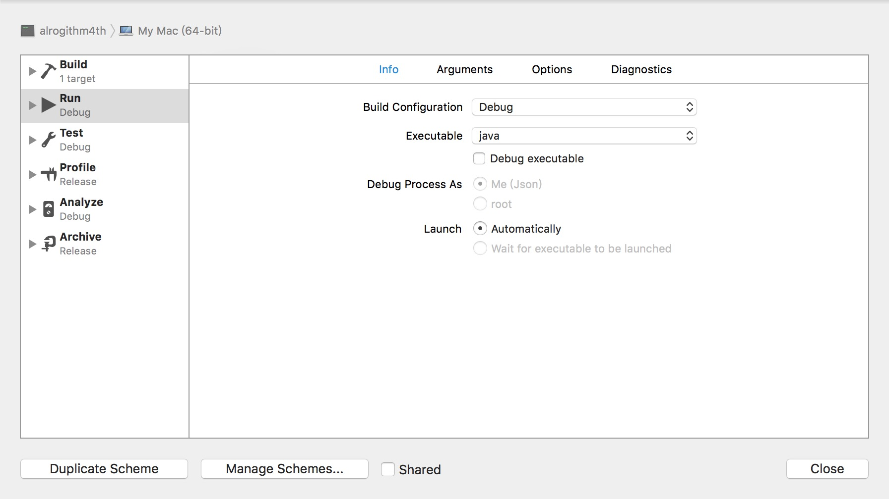
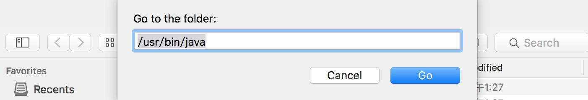
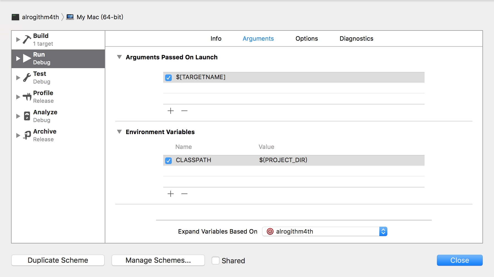

# Compile Java In Xcode
Recently I start to read Algorithm 4th which uses Java to express the thought of algorithm. However , I had not even write a `helloworld.java` file until I opened this book.

I found some steps to compile java in Xcode and I make of note of these steps.

1. Install java and make sure there are bin files named `java` and `javac` in your `/usr/bin/` ;
2. Open Xcode ;
3. **New project - Other - External Build System**;
4. Set the `build tool` to `/usr/bin/javac`;
5. **New file - Empty file** ,and input `helloWorld.java` as the name of this new file.

		public class helloWorld
		{
			public static void main(String[] args)
			{
				System.out.println("hello world");
			}
		}

5. Clicking the **Run >** button should at least compile  your file now, but it is not really running . However , you can find a compiled file named `<JavaFileName>.class` in the same place if things go right;
6. And then we focus on the menu and select **Projuct - Scheme - Edit Scheme** , select **Executable - other...** and use `command+shift+G` to located the `/usr/bin/java` ,at the same time you should uncheck the **Debug Executable** if you don't need that;

8. Select **Argument** tab and add argument and variable as follow(You can add common arguments which you like to pass on launch);

9. Now you can enjoy the automatic compiling and running Java program code with Xcode by simple hitting `command + R`.

Watch the tutorial in video version : [https://www.youtube.com/watch?v=CmbdOfYNc3g](https://www.youtube.com/watch?v=CmbdOfYNc3g)

